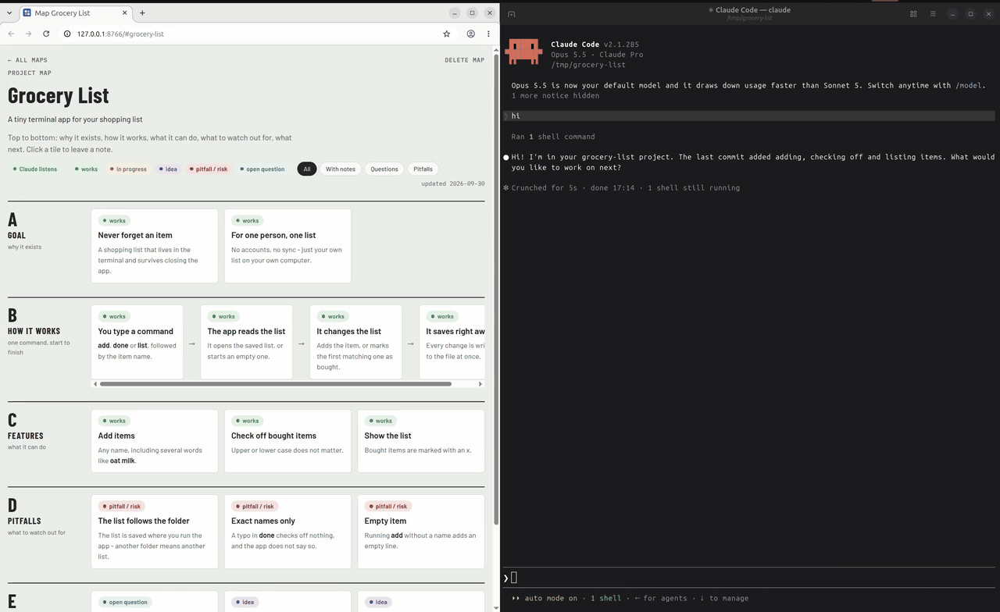

# Project Map

[](https://github.com/Tyr9102/project-map/actions/workflows/test.yml)

A Claude Code plugin that turns a conversation about your project into a map of tiles in the browser. You leave notes on the tiles, click **Send**, and the Claude Code session you have open wakes up by itself, replies next to the tiles and updates the map.



*Real recording, sped up while Claude works: the note is sent on the left, the session on the right wakes within a second.*

Made for people who think about a project without reading its code: about 20 tiles in plain language, in zones read top to bottom - goal, how it works, features, rules and pitfalls, questions and ideas.

## What it does

- **"Make a project map"** - Claude reads the project's docs and history, checks features against the code and builds the map. Tiles it could not confirm are marked as open questions.
- **Notes on tiles** - comment, question or suggestion. Collect a few drafts, then Send them as one batch.
- **Send wakes the session** - within 1-2 seconds, no typing in the terminal. Replies appear next to the tiles.
- **The map keeps up** - after a commit Claude updates the tiles; at session start it reports commits the map has not seen. Decisions from the conversation go on the map at once; ideas from a brainstorm only the ones you pick at its end, so the map does not fill up with every "what if".
- **Everything stays local** - the page runs on `127.0.0.1`, maps are plain JSON files on your disk. Nothing is sent anywhere except to Claude, as part of your normal session.

The page speaks English or Polish, following your browser language.

## Requirements

- [Claude Code](https://code.claude.com)
- Python 3.9 or newer as `python3` or `python` (standard library only, nothing to install)
- git (for the "map keeps up" features)
- On Windows: Git Bash, which comes with Git for Windows

## Install

In Claude Code:

```
/plugin marketplace add Tyr9102/project-map
/plugin install project-map@project-map
```

Then allow the watcher - the small background command that lets **Send** wake your session. Run `/permissions` and add the allow rule `Bash(project-map-watch:*)`, or put it in `~/.claude/settings.json`:

```json
{
  "permissions": { "allow": ["Bash(project-map-watch:*)"] }
}
```

Without it, auto mode may block the watcher (it runs code from the plugin, not from your project) and the map works without waking Claude - you type "check the map" instead.

Then, in a project directory, tell Claude: **"make a project map"**. It gives you the address, by default `http://127.0.0.1:8765`.

## Settings

Optional, in the `env` block of `~/.claude/settings.json`, so the hooks and the commands Claude runs see the same values:

| Variable | Default | Meaning |
| --- | --- | --- |
| `PROJECT_MAP_DIR` | `~/.project-map` | Where maps are kept |
| `PROJECT_MAP_PORT` | `8765` | Local port of the map page |

```json
{
  "env": { "PROJECT_MAP_DIR": "/home/you/maps", "PROJECT_MAP_PORT": "8790" }
}
```

**History and backup:** make the maps directory a git repository (`git init` inside it) and Claude commits every map change there.

## How it works

- A small local server (Python, standard library) serves the page and stores notes as files, one file per note. The plugin starts it at session start in a project that has a map.
- A watcher runs as a Claude Code background task. Send writes a signal file; the watcher sees it, prints it and exits - and the end of a background task is what wakes the session. Claude then starts a new watcher.
- A hook checks on every message whether this session's watcher is alive and asks Claude to start one when it is not.
- The server refuses changes coming from other websites open in your browser.

## Limitations - read before relying on it

- **It relies on Claude Code behaviour, not a documented API:** the session wakes because a finished background task starts a new turn. A Claude Code update may change that.
- **The watcher lives at most 2 hours** (the Claude Code limit for a background task). The next message you type starts a new one.
- **Every wake-up costs tokens** - it is a full turn with the whole session context. Send notes in batches and open the map in a fresh session.
- **Used day to day on Linux only.** The automated tests pass on Linux, macOS and Windows, but nobody has used it on macOS or Windows yet.
- After a plugin update, a server that is already running keeps the old version until you stop it - tell Claude **"stop the map server"**. The next Claude Code session starts the new one.

## Uninstall

First tell Claude **"stop the map server"**, then:

```
/plugin uninstall project-map@project-map
```

Your maps stay in `~/.project-map` (or your `PROJECT_MAP_DIR`) - delete that directory yourself if you no longer need them. Remove the `Bash(project-map-watch:*)` permission rule if you added it.

## Development

```
python3 tests/run_tests.py        # hook, watcher and server tests, on scratch maps and a free port
claude --plugin-dir .             # run Claude Code with the plugin from this directory
```

## License

MIT
